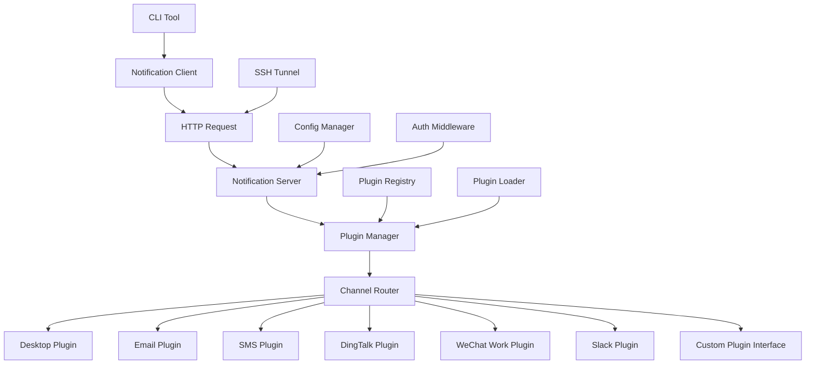

# Design Document

## Overview

The SSH Notify Tool is designed as a client-server notification system using Node.js, providing seamless notification delivery across local and remote execution environments. The system employs a modular architecture with plugin-based notification channels, REST API communication, and SSH tunnel integration for secure remote notifications.

## Steering Document Alignment

### Technical Standards (tech.md)
Since no existing tech.md was found, this design follows Node.js best practices:
- ES6+ module system with CommonJS compatibility
- Asynchronous programming patterns using async/await
- RESTful API design principles
- Secure configuration management
- Cross-platform compatibility standards

### Project Structure (structure.md)
Following Node.js project conventions:
- Separation of server and client applications
- Plugin-based architecture for extensibility
- Configuration-driven behavior
- Standard npm package structure

## Code Reuse Analysis

### Existing Components to Leverage
Since this is a new project, we'll leverage:
- **Node.js Built-ins**: `http`, `fs`, `path`, `os` for core functionality
- **Express Framework**: For REST API server implementation
- **Community Packages**: Well-established libraries for specific functionality

### Integration Points
- **System Notification APIs**: Platform-specific desktop notification systems
- **SMTP Servers**: Standard email delivery infrastructure
- **SMS Providers**: Third-party APIs (Twilio, Aliyun SMS)
- **SSH Infrastructure**: Existing SSH client/server systems

## Architecture

The system follows a microservices-inspired architecture with clear separation of concerns:

### Modular Design Principles
- **Single File Responsibility**: Each file handles one specific domain (server, client, notification channels, configuration)
- **Component Isolation**: Notification channels are isolated plugins with standard interfaces
- **Service Layer Separation**: API layer, business logic, and notification delivery are separate layers
- **Utility Modularity**: Configuration, logging, and validation utilities are focused modules



## Plugin Architecture

The notification system adopts a plugin-based architecture to support easy extension with new notification channels. This design enables:

### Plugin Discovery and Loading
- **Dynamic Plugin Loading**: Plugins are loaded from configurable search paths at runtime
- **Plugin Validation**: Each plugin must implement the required interface and pass validation checks  
- **Hot Plugin Reloading**: Support for reloading plugins without server restart (future enhancement)
- **Plugin Dependencies**: Plugins can declare dependencies on other plugins or system components

### Plugin Interface Specification
```javascript
// Required interface that all plugins must implement
class NotificationChannelPlugin {
  // Plugin metadata
  static get metadata() {
    return {
      name: 'plugin-name',           // Unique plugin identifier
      displayName: 'Display Name',   // Human-readable name
      version: '1.0.0',             // Semantic version
      author: 'Plugin Author',       // Author information
      description: 'Plugin description',
      capabilities: ['text', 'images', 'attachments'], // Supported features
      configSchema: { /* JSON Schema */ } // Configuration validation schema
    };
  }

  // Required methods
  async send(notification) { /* Implementation */ }
  async validate(config) { /* Implementation */ }
  async isAvailable() { /* Implementation */ }
  
  // Optional lifecycle methods
  async setup(config) { /* Called during plugin initialization */ }
  async cleanup() { /* Called during shutdown */ }
  async healthCheck() { /* Health status check */ }
}
```

### Plugin Categories
- **Built-in Plugins**: Core notification channels (desktop, email, SMS) included with the system
- **Official Plugins**: Additional channels maintained by the project (DingTalk, WeChat Work, Slack)
- **Third-party Plugins**: Community-developed plugins following the plugin interface
- **Custom Plugins**: User-specific plugins for internal systems or specialized requirements

### Plugin Development Guidelines
- **Standard Interface**: All plugins must extend the base NotificationChannelPlugin class
- **Configuration Schema**: Plugins must provide JSON schema for configuration validation
- **Error Handling**: Plugins should handle errors gracefully and provide meaningful error messages
- **Testing**: Plugins should include unit tests and integration tests
- **Documentation**: Plugin documentation should include setup instructions and configuration examples

## Components and Interfaces

### Notification Server
- **Purpose:** Central service that receives notification requests and routes them to appropriate channels
- **Interfaces:** 
  - `POST /notify` - Accept notification requests
  - `GET /health` - Health check endpoint
  - `GET /config` - Get current configuration status
- **Dependencies:** Express, authentication middleware, channel plugins
- **Reuses:** Node.js http module, configuration utilities

### Notification Client
- **Purpose:** CLI utility that sends notification requests to the server
- **Interfaces:**
  - `notify(options)` - Main notification function
  - Command-line interface for direct usage
- **Dependencies:** HTTP client library (axios), configuration loader
- **Reuses:** Node.js built-in modules for CLI argument parsing

### Plugin Manager
- **Purpose:** Central plugin management system for loading, registering, and coordinating notification channels
- **Interfaces:**
  - `loadPlugin(pluginPath)` - Dynamically load notification channel plugins
  - `registerPlugin(plugin)` - Register plugin in the system
  - `getAvailableChannels()` - Get list of available notification channels
  - `validatePlugin(plugin)` - Validate plugin implements required interface
- **Dependencies:** Plugin loader, configuration manager
- **Reuses:** File system operations for plugin discovery

### Channel Plugin Interface (Abstract Base)
- **Purpose:** Standard interface that all notification channel plugins must implement
- **Required Methods:**
  - `send(notification)` - Send notification through this channel
  - `validate(config)` - Validate channel-specific configuration
  - `isAvailable()` - Check if channel is available in current environment
  - `getName()` - Return unique channel identifier
  - `getDisplayName()` - Return human-readable channel name
  - `getConfigSchema()` - Return JSON schema for configuration validation
  - `getCapabilities()` - Return supported features (text, images, attachments, etc.)
- **Optional Methods:**
  - `setup()` - Initialize channel (called once during startup)
  - `cleanup()` - Cleanup resources (called during shutdown)
  - `healthCheck()` - Check channel health status
- **Properties:**
  - `version` - Plugin version
  - `author` - Plugin author
  - `description` - Plugin description

### Built-in Channel Plugins
- **Desktop Plugin**: Native desktop notifications (Windows Toast, macOS Notification Center, Linux notify-send)
- **Email Plugin**: SMTP email delivery with multiple provider support
- **SMS Plugin**: SMS delivery via Twilio, Aliyun, and other providers
- **DingTalk Plugin**: 钉钉企业通知 via webhook API
- **WeChat Work Plugin**: 企业微信通知 via webhook API  
- **Slack Plugin**: Slack notifications via webhook API

### Configuration Manager
- **Purpose:** Handle configuration loading, validation, and secure storage
- **Interfaces:**
  - `loadConfig()` - Load configuration from file system
  - `validateConfig(config)` - Validate configuration structure
  - `getSecureValue(key)` - Retrieve sensitive configuration values
- **Dependencies:** Node.js fs module, JSON schema validation
- **Reuses:** Standard Node.js file system operations

### Authentication Middleware
- **Purpose:** Verify authentication tokens for incoming requests
- **Interfaces:**
  - `authenticate(req, res, next)` - Express middleware function
  - `generateToken()` - Generate new authentication tokens
- **Dependencies:** Express framework
- **Reuses:** Node.js crypto module for token generation

## Data Models

### Notification Request
```javascript
{
  title: string,           // Notification title
  message: string,         // Main notification content
  level: string,          // 'info' | 'warning' | 'error'
  channels: string[],     // Array of channel names to use
  attachments: object[],  // Optional file attachments
  metadata: object        // Additional channel-specific data
}
```

### Configuration Model
```javascript
{
  server: {
    port: number,         // Server listening port
    host: string,         // Bind address (default: '127.0.0.1')
    authToken: string     // Authentication token
  },
  plugins: {
    enabled: string[],    // List of enabled plugin names
    searchPaths: string[], // Plugin search directories
    config: {             // Plugin-specific configurations
      desktop: {
        enabled: boolean
      },
      email: {
        enabled: boolean,
        smtpHost: string,
        smtpPort: number,
        user: string,
        pass: string,
        from: string,
        to: string[]
      },
      sms: {
        enabled: boolean,
        provider: string,   // 'twilio' | 'aliyun'
        credentials: object
      },
      dingtalk: {
        enabled: boolean,
        webhook: string,    // 钉钉机器人webhook地址
        secret: string,     // 加签密钥 (可选)
        atMobiles: string[], // @指定手机号
        isAtAll: boolean    // 是否@所有人
      },
      wechatwork: {
        enabled: boolean,
        webhook: string,    // 企业微信机器人webhook地址
        mentionedList: string[], // @成员列表
        mentionedMobileList: string[] // @手机号列表
      },
      slack: {
        enabled: boolean,
        webhook: string,    // Slack webhook URL
        channel: string,    // 目标频道
        username: string,   // 机器人用户名
        iconEmoji: string   // 机器人图标
      }
    }
  },
  logging: {
    level: string,        // 'debug' | 'info' | 'warn' | 'error'
    file: string         // Log file path
  }
}
```

### Plugin Configuration Schema
```javascript
// Example plugin configuration schema
{
  pluginName: {
    enabled: boolean,           // Enable/disable plugin
    priority: number,           // Plugin execution priority (optional)
    retryAttempts: number,      // Number of retry attempts (optional)
    timeout: number,            // Request timeout in milliseconds (optional)
    // Plugin-specific configuration fields
    ...pluginSpecificConfig
  }
}
```

### Channel Response
```javascript
{
  channel: string,        // Channel name
  success: boolean,       // Delivery success status
  message: string,        // Success/error message
  timestamp: string,      // ISO timestamp
  metadata: object        // Channel-specific response data
}
```

## Error Handling

### Error Scenarios
1. **Server Unavailable:** Network connection fails to notification server
   - **Handling:** Client retries with exponential backoff, falls back to stderr logging
   - **User Impact:** CLI tool continues execution, warning logged about notification failure

2. **Authentication Failure:** Invalid or missing authentication token
   - **Handling:** Server returns 401 Unauthorized, client logs authentication error
   - **User Impact:** Clear error message indicating configuration issue

3. **Channel Delivery Failure:** Specific notification channel fails (SMTP error, SMS quota exceeded)
   - **Handling:** Server attempts other configured channels, logs specific error
   - **User Impact:** Notification delivered through alternative channels when possible

4. **Configuration Errors:** Invalid configuration file or missing required settings
   - **Handling:** Application validates config on startup, provides specific error messages
   - **User Impact:** Clear guidance on how to fix configuration issues

5. **SSH Tunnel Disconnection:** Network interruption breaks SSH port forwarding
   - **Handling:** Client detects connection failure, provides guidance for tunnel re-establishment
   - **User Impact:** Instructions for restarting SSH tunnel

## Testing Strategy

### Unit Testing
- **Framework:** Jest for JavaScript testing
- **Coverage:** All core business logic functions (notification routing, channel plugins, configuration validation)
- **Mocking:** External dependencies (SMTP servers, SMS APIs, system notification services)
- **Key Components:** Each channel plugin, configuration manager, authentication middleware

### Integration Testing
- **API Testing:** Full request/response cycles for notification endpoints
- **Channel Integration:** Real notification delivery to test accounts/numbers
- **Configuration Loading:** File system operations and environment variable handling
- **Key Flows:** End-to-end notification delivery through each channel type

### End-to-End Testing
- **Local Scenario:** Server and client on same machine, desktop notifications
- **Remote Scenario:** SSH tunnel setup, notification delivery from remote client
- **Multi-Channel:** Simultaneous delivery through multiple notification channels
- **Error Recovery:** Network failures, configuration changes, service restarts
- **User Scenarios:** 
  - CLI tool integration and usage
  - SSH tunnel setup and port forwarding
  - Configuration file creation and management